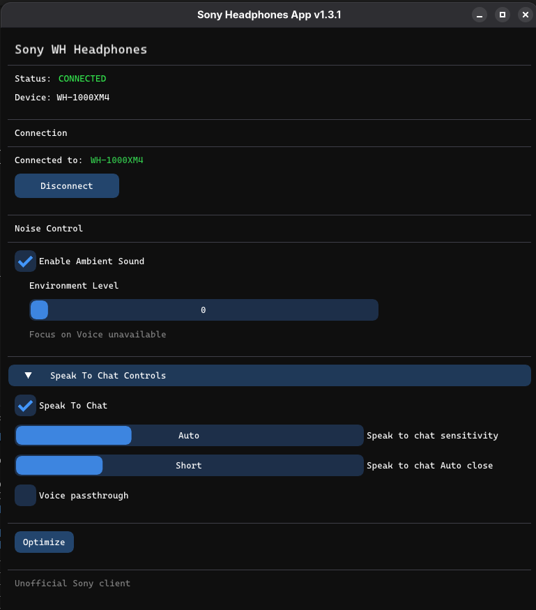

# Sony Headphones Client (Enhanced Fork)

<p align="center">

# Sony Headphones Client

Desktop alternative to Sony's mobile-only Headphones application.

Manage Sony headphone settings directly from Linux, Windows and macOS.

Maintained fork with UI redesign, Linux improvements, Bluetooth fixes and better compatibility with modern systems.

</p>

---

## About This Fork

This project is a maintained fork of the original Sony Headphones Client by Plutoberth.

The original repository became inactive, so this fork continues development with:

- Linux improvements
- Wayland compatibility fixes
- UI redesign
- Bluetooth reliability fixes
- WH-1000XM4 improvements
- Better startup and shutdown handling
- Ongoing maintenance

---

# Screenshots

Enhanced Linux UI

<p align="center">

</p>

Modernized interface:

- adaptive full-screen layout
- cleaner spacing
- capability-aware controls
- improved connection handling
- enhanced Linux support

---

# Features

Current implemented functionality:

- [x] Ambient Sound Control
- [x] Noise Cancelling
- [x] Speak To Chat
- [x] Multipoint Device Controls
- [x] Virtual Sound / VPT
- [x] Sound Position Controls
- [x] Optimizer
- [x] Capability detection
- [x] Improved Linux Bluetooth support
- [x] Wayland support improvements
- [x] WH-1000XM4 improvements
- [x] Automatic state synchronization
- [x] Clean shutdown handling

Planned:

- [ ] Battery display
- [ ] Equalizer
- [ ] Read full device state
- [ ] Additional Sony device support

---

# Supported Platforms

- Linux (X11-Wayland)
- Windows
- macOS


Special support focus:

- Debian
- Ubuntu
- Fedora

---

# Supported Headsets

Known working devices:

- WH-1000XM3
- WH-1000XM4
- MDR-XB950BT

Other devices may work.

Compatibility reports are welcome.

---

# Installation

Clone recursively:

```bash
git clone --recurse-submodules \
https://github.com/jespinobe/SonyHeadphonesClient.git
```

If submodules fail:

```bash
git submodule sync
git submodule update --init --recursive
```

---

# Build

## Debian / Ubuntu

Install dependencies:

```bash
sudo apt install \
libbluetooth-dev \
libglew-dev \
libglfw3-dev \
libdbus-1-dev
```

Create build directory:

```bash
cd Client

mkdir build

cd build
```

Configure:

```bash
cmake ..
```

If CMake policy errors appear:

```bash
cmake .. \
-DCMAKE_POLICY_VERSION_MINIMUM=3.5
```

Compile:

```bash
cmake --build . -j$(nproc)
```

Run:

```bash
./SonyHeadphonesClient
```

---

## Fedora

```bash
sudo dnf install \
bluez-libs-devel \
glew-devel \
glfw-devel \
dbus-devel
```

---

## Windows

Requirements:

- Visual Studio Community 2022
- C++ Desktop Components
- Windows SDK
- CMake

Build:

```bash
cd Client

mkdir build

cd build

cmake ..

cmake --build .
```

---

## macOS

Use included Xcode project.

---

# Desktop Installation (Linux)

The project includes an installer script that:

- installs application into `/opt`
- creates desktop launcher
- registers menu entry
- installs icon
- allows launching directly from desktop menus

Run:

```bash
cd packaging

chmod +x install.sh

./install.sh
```

Application appears as:

```text
Sony Headphones Client
```

inside your desktop launcher.

---

# Linux Notes

If headphones connect but controls do not appear:

Verify:

- headphones are paired
- headphones are connected through BlueZ
- RFCOMM service is available
- audio profile is active

Useful commands:

List devices:

```bash
bluetoothctl devices
```

Connect manually:

```bash
bluetoothctl
connect XX:XX:XX:XX:XX
```

Bluetooth logs:

```bash
journalctl -f | grep bluetooth
```

---

# What's New In This Fork

## UI Improvements

- redesigned interface
- cleaner layout
- adaptive sizing
- better readability
- improved status display
- improved visual feedback

## Linux Improvements

- Wayland compatibility improvements
- Bluetooth fixes
- better connection handling
- improved async behavior
- fixed listener initialization
- fixed shutdown hangs

## Device Improvements

- improved WH-1000XM4 support
- automatic state synchronization
- capability refresh after connect
- more reliable initialization

## Stability Improvements

- reduced duplicate commands
- commands only sent on changes
- better error handling
- clean thread shutdown
- improved disconnect handling

---

# Development Notes

Important fixes implemented:

### Listener startup

```cpp
this->_listener=
std::make_unique<Listener>(
    this->_headphones,
    this->_bt
);
```

### Automatic state sync

```cpp
this->_headphones.queryState();
```

### Proper shutdown handling

Background listener threads now terminate correctly on disconnect and application exit.

---

# Original Project

Original archived repository:

https://github.com/Plutoberth/SonyHeadphonesClient

Huge thanks to the original contributors.

---

# Contributors

Original project:

- Plutoberth — Initial implementation
- aybruh00 
- Mr-M33533K5 — Bluetooth interface
- semvis123 — macOS support
- jimzrt — Linux support
- guilhermealbm — Noise cancelling controls

Fork improvements:

- Linux redesign
- Wayland support
- Bluetooth fixes
- WH-1000XM4 support
- UI modernization
- shutdown fixes
- ongoing maintenance

---

# License

Distributed under MIT License.

See LICENSE for additional information.
